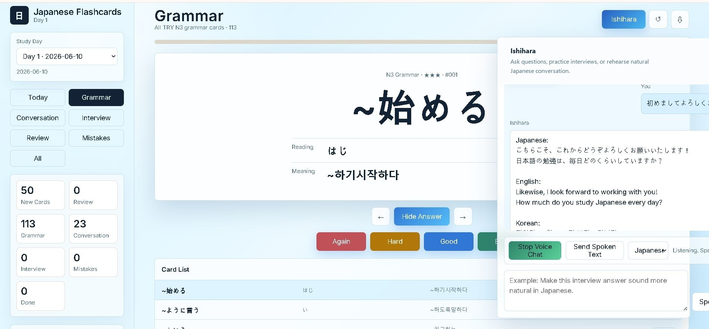
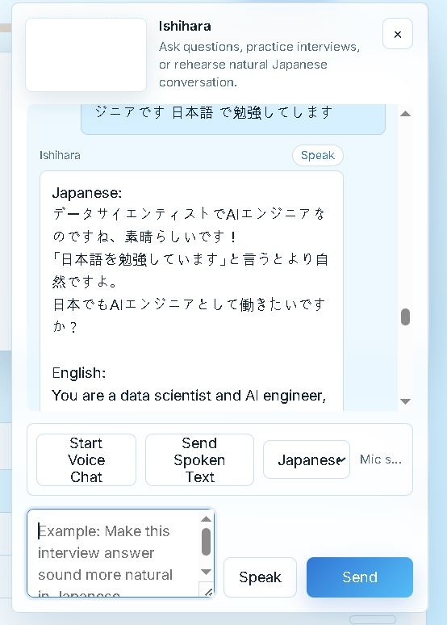
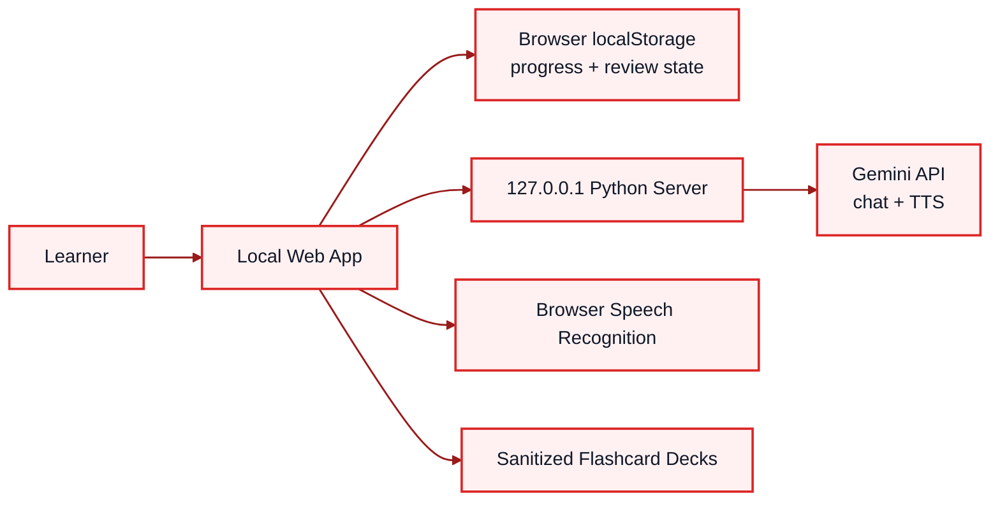

# Japanese Learning AI Tutor

日本語学習、JLPT対策、面接練習、AI会話練習を一つにまとめたローカルファーストの学習Webアプリです。  
このリポジトリは公開用の技術ケーススタディとして、個人データ・APIキー・私的な学習資料を除外した sanitized demo です。



## Project Summary

このプロジェクトでは、毎日の暗記学習を継続しやすくするために、フラッシュカード、復習スケジューリング、AIチューター、音声会話、面接練習を統合しました。  
ユーザーの学習資料を扱うため、ブラウザとローカルサーバー中心で動作し、APIキーや元データを公開リポジトリに含めない設計にしています。

### Key Features

- JLPT vocabulary and grammar flashcards
- Daily study plan, review queue, mistake review, and progress tracking
- Conversation and interview practice decks
- AI tutor chat powered by Gemini-compatible local API proxy
- Japanese answer correction with English, Korean, and pronunciation support
- Speech recognition workflow for voice conversation practice
- Text-to-speech endpoint for Japanese listening practice
- Privacy-conscious local execution model
- Responsive UI with desktop and compact chat layouts

## Screenshots

### Flashcards + AI Tutor


### Voice Chat



## Architecture



The browser owns the learning interaction and progress state. The Python server is intentionally small: it serves static files, keeps API keys out of frontend JavaScript, and proxies AI/TTS requests.

## How I Built It

1. Defined the learning workflow: daily cards, grammar practice, conversation, interview practice, review, mistakes, and all-card search.
2. Designed a local-first architecture so sensitive study material is not uploaded to a hosted backend.
3. Built a responsive flashcard UI with stable card dimensions, progress indicators, rating buttons, and searchable card lists.
4. Added spaced-review logic with daily offsets and mistake-focused review.
5. Implemented a floating AI tutor panel for Japanese correction and interview practice.
6. Moved AI calls behind a local Python server so the API key is never exposed in frontend code.
7. Added multilingual response normalization: Japanese, English, Korean, and Korean Hangul pronunciation.
8. Added speech recognition controls that wait for explicit send, preventing accidental submission while speaking.
9. Added text-to-speech support and a fallback browser voice for lower-latency conversation practice.
10. Stabilized the UI against long Japanese, Korean, and romaji messages by enforcing wrapping and fixed panel width.
11. Sanitized this repository by replacing private decks with sample data and excluding all local secrets.

For a detailed implementation narrative, see [docs/BUILD_STORY.md](docs/BUILD_STORY.md).

## Run Locally

Requirements:

- Python 3.10+
- A modern browser such as Chrome
- Optional: Gemini API key for AI tutor and TTS features

```powershell
cd app
python server.py
```

Open:

```text
http://127.0.0.1:8765
```

To enable AI tutor features:

```powershell
copy gemini_api_key.local.example gemini_api_key.local
```

Then paste a Gemini API key into `gemini_api_key.local`. This file is ignored by git.

## Repository Structure

```text
app/
  index.html                  # Main UI
  styles.css                  # Responsive visual design
  app.js                      # Flashcards, review logic, chat UI, voice controls
  data.js                     # Sanitized sample deck data
  server.py                   # Local API proxy and static server
  gemini_api_key.local.example
assets/screenshots/
  grammar-ai-tutor-main.JPG
  voice-chat-mobile.JPG
docs/
  ARCHITECTURE.md
  BUILD_STORY.md
  PRIVACY_AND_SECURITY.md
  INTERVIEW_NOTES_JA.md
```

## Privacy and Security

This public repository does not include:

- Real private study documents
- API keys
- Google account information
- Original private flashcard datasets
- Personal notes or interview scripts

The demo data is intentionally small and fictional. See [docs/PRIVACY_AND_SECURITY.md](docs/PRIVACY_AND_SECURITY.md).

## Tech Stack

- HTML, CSS, JavaScript
- Python `http.server`
- Browser `localStorage`
- Browser SpeechRecognition API
- Gemini API via local proxy
- Gemini TTS-compatible audio response handling

## What This Demonstrates

- Product thinking for a real learning workflow
- Frontend state management without unnecessary framework overhead
- API key isolation and local-first privacy design
- Prompt and response-shaping for multilingual AI tutoring
- UX iteration based on actual usage issues: latency, accidental voice sends, wrapping bugs, and incomplete translations
- Documentation quality for a professional engineering case study
