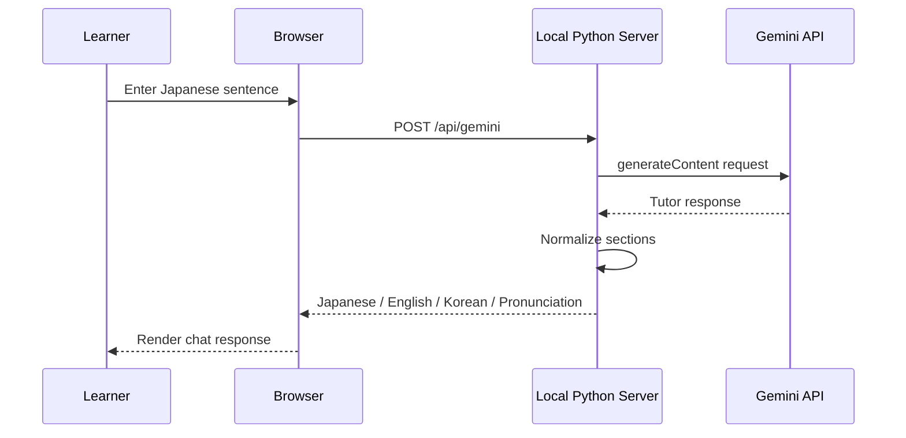

# Architecture

## Overview

Japanese Flashcards AI Tutor is a local-first web application. It uses a browser frontend for learning interactions and a small Python server for static hosting and AI API proxying.

## Components

### Browser App

Responsibilities:

- Render flashcards
- Manage active study mode
- Store progress in localStorage
- Capture speech recognition results
- Play TTS audio
- Display AI tutor conversation

### Local Python Server

Responsibilities:

- Serve static files
- Read API key from environment or local-only file
- Proxy `/api/gemini`
- Proxy `/api/tts`
- Normalize AI responses
- Prevent frontend exposure of secrets

### AI Provider

Responsibilities:

- Generate tutoring responses
- Translate Japanese into English and Korean
- Generate Korean Hangul pronunciation
- Produce Japanese speech audio when available

## Request Flow

## State Management

The app stores progress in browser localStorage:

- Card attempts
- Correct counts
- Last rating
- Last studied day
- Imported custom decks

This is enough for a personal learning tool and keeps the architecture small.

## Design Choices

- Plain JavaScript: easy to audit and run locally
- Python standard library server: no backend framework required
- Local API proxy: hides secrets from browser code
- Sample deck data: safe for public technical review
- Fixed-width chat panel: avoids layout instability during long AI responses
